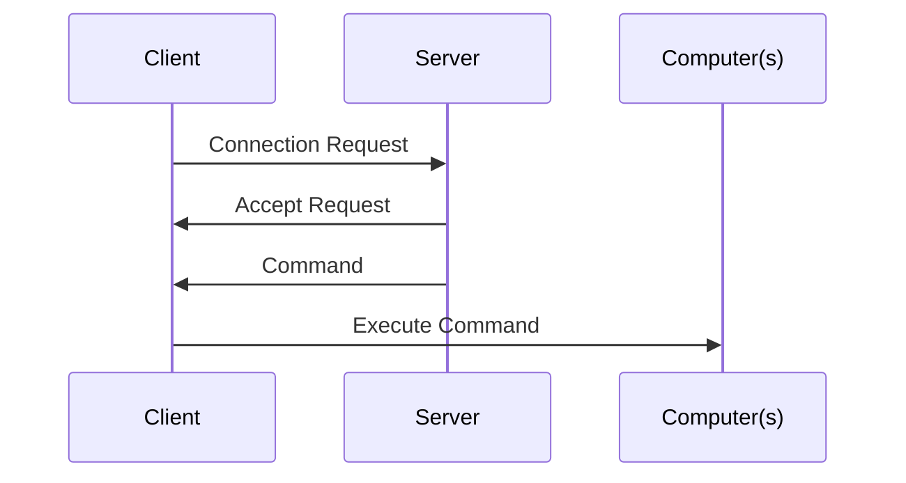

# Reverse Shell

This is a reverse shell for ethical hacking, please use this for educational or testing purposes only :)

# Shell

Except for the server address, everything in the files should work on start (Remember to keep the Servers address as a string!)

## How to use

* 1) You will need to host/run Server.py or MiniServer.py, this will be getting and sending info

* 2) Change the IP address in Client.py or MiniClient.py (>IP<) to your server's IP address so it can connect

* 3) Run your client file

* 4) Run your commands from your Server instance
It should look like this

`[ + ] Server created | {port}`

`[ + ] Binding connection | {port}`

`[ + ] Connection establisted | {clientIP}, {clientPort}`

`[ $ ] Server | `

### Diagram | how it works

* This is a simplified version

